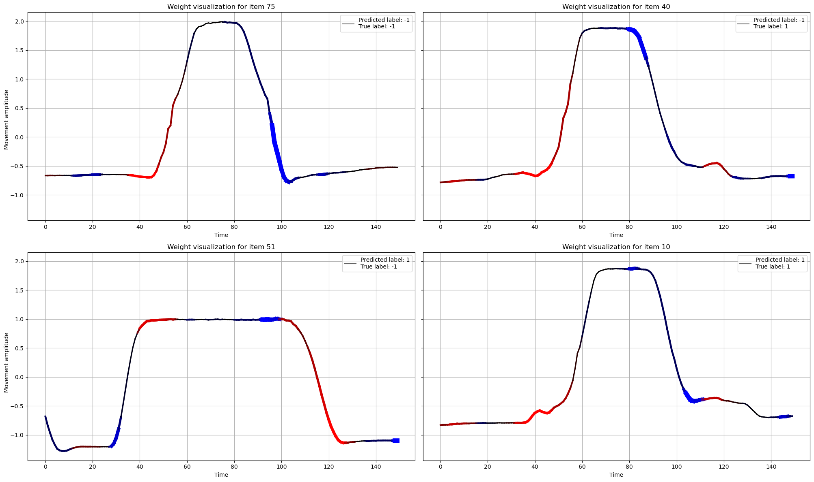

# Interpretable Time Series Classification

A full re-implementation of the [**MrSEQL**](https://arxiv.org/pdf/2006.01667) method for interpretable time series classification, based on symbolic discretization and subsequence logistic regression.

Time series are first converted into symbolic strings (SAX/SFA discretization), then frequent and discriminative subsequences are mined and used as binary features for a logistic regression classifier. The resulting model is interpretable by design: each feature corresponds to a specific pattern in the original signal, and its regression weight directly indicates how much that pattern pushes toward one class or the other.

The plot below illustrates this interpretability — each time series is colored by the sign of the contributing subsequences' weights: **red** segments push toward one class, **blue** toward the other, and **black** segments are neutral. This makes it easy to see exactly which parts of the signal drove the prediction, and where the model gets confused (e.g. item 40 and 51 are misclassified).

## Structure
- `MrSEQL.ipynb` — full pipeline: discretization, subsequence mining, logistic regression, and weight visualization
- `TSC.ipynb` — exploratory time series classification experiments
- `Data/` — dataset files
- `report.pdf` — written report detailing the method and results
